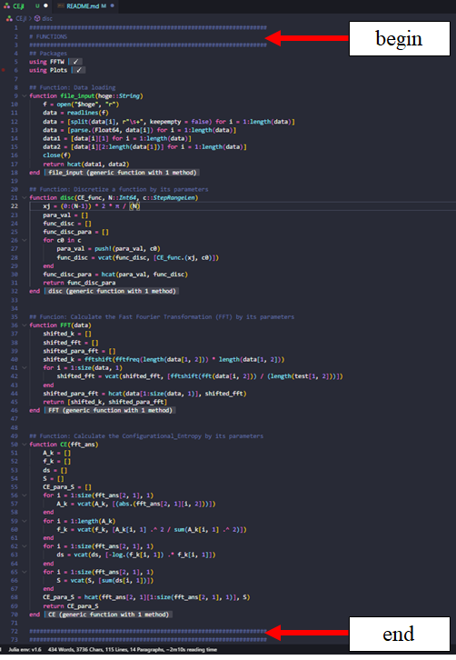
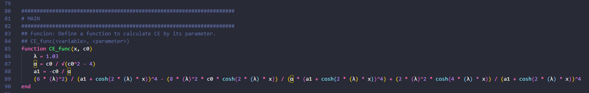
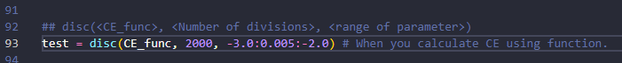
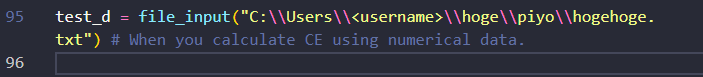
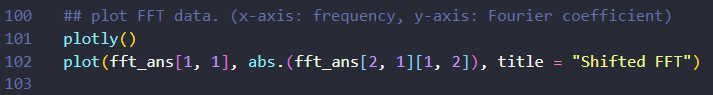
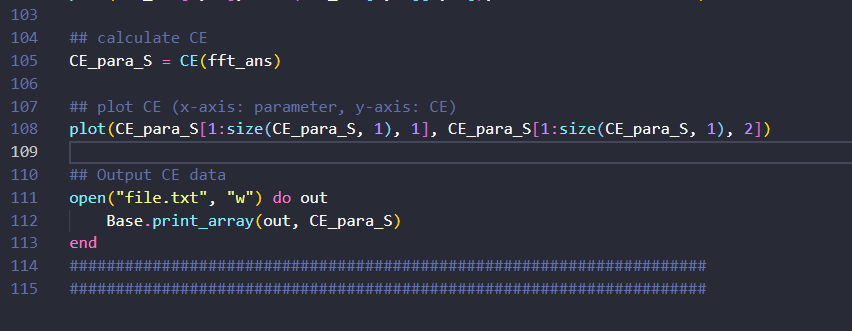

# Configurational Entropy in Julia
This repository include Julia language codes for Configurational Entropy (CE) produced by [Gleiser et al](https://arxiv.org/ct?url=https%3A%2F%2Fdx.doi.org%2F10.1016%2Fj.physletb.2012.05.064&v=07d93dad). 

**Note that this program can calculate CE whether the data is given as a function or as numerical data, but since it uses FFT, it can only be applied to periodic functions!** 

# How to use
This program is written in the Julia language, and calculates CE by simply entering a function or numerical data. 

## 1. Load the function to be used for the calculation in Julia.
In this section, All you have to do is `ctrl+enter` from the top to the separator line.

## 2. Define function or input numerical data
If you want to calculate the CE per parameter from a function, read 1-1; if you want to calculate the CE per parameter from numerical data, read 1-2.

### 2-1. Define a function to calculate the CE for each parameter.
Follow the example below to enter a function in `CE_func(<variable>,<parameter>)` that varies with parameters. The first argument should be the argument (variable) of the function you want to use, the second argument should be the parameter you want to change.

As an example, I use the following equation from paper by [Correa et al](https://www.sciencedirect.com/science/article/pii/S0370269314006522).

After that, let the user specify how many data points to divide the function into, and in what range to change the parameters in `disc(CE_func,\<Number of divisions\>, \<range of parameter\>`), and store the values in array called *test*.

### 2-2. Input data
If you want to calculate the CE per parameter from numerical data, please create a text file in the following form. 
Separate the data interval with a space, and put the changed parameter in the first column and the resulting function value in the second column.

| Parameter values | numerical function value |
| ---------------- | ---------------------    |
| 1.0              | 3.1                      |
| 1.1              | 4.1                      |
| 1.2              | 1.5                      |
| ⋮                | ⋮                        |
|                  |                          |

Then, input the **full path** of the data into the `input_file function("C:\\hoge.txt")` and store it in the test_d array.

## Calculate Fast Fourier TransForm
To calculate FFT, Enter test or test_d into the `fft(<test or test_d>)` function. And for those who want to look details, the array storing the `fft_ans` is structured as follows.

| | | |
| :-----------------:|:--------------------:    |:--------------------:|
|> | -100,-99, ・・・, 0,1, ・・・,99, 100 |Fourier Frequency|
| 1.1             | [3.14+1.59i, 2.65+3.58i, ・・・ 5.92+3.23i]                     |parameter \| [fft values per parameter]
|1.2            | [3.14+1.59i, 2.65+3.58i, ・・・ 5.92+3.23i]                  |parameter \| [fft values per parameter]
| ⋮                | ⋮                        | ⋮

In order to plot the FFT results with frequency on the horizontal axis and Fourier coefficients on the vertical axis, we will do the following. Note that it will take a little time if you are running it for the first time.

**The FFT in this program uses the FFTW package, the algorithm of which can be found on the [official website](https://juliamath.github.io/FFTW.jl/latest/index.html). Note that the period of the Fourier transform is taken as [0:2pi)**

## Calculate Configurational Entropy
After following the above steps, if you run the program in a straightforward manner, fft_ans will be passed to `CE(<fft_ans>)` as an argument, and CE will be calculated. Then the CE for each parameter is saved in file.txt and plotted at the same time.

